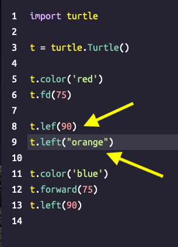
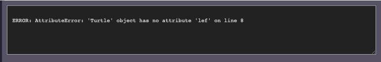
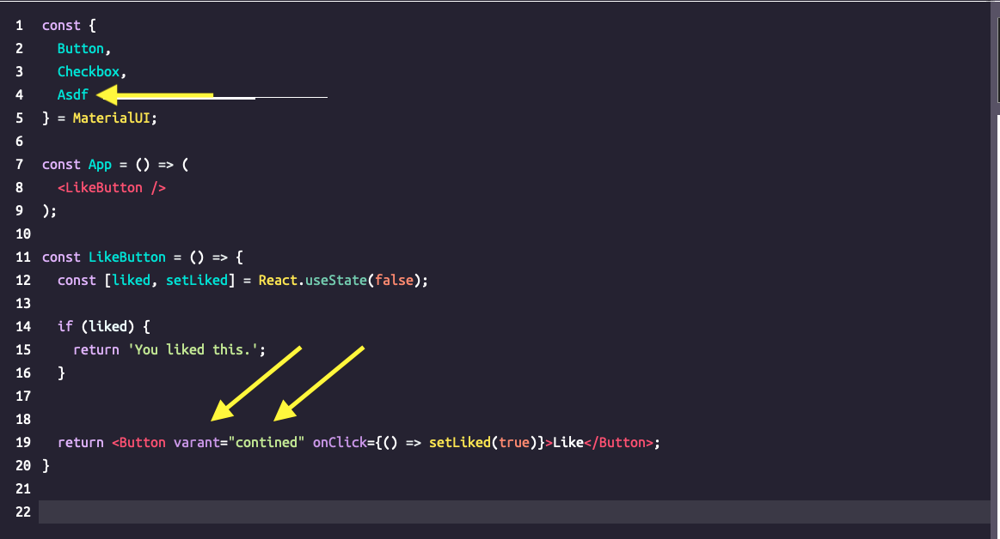
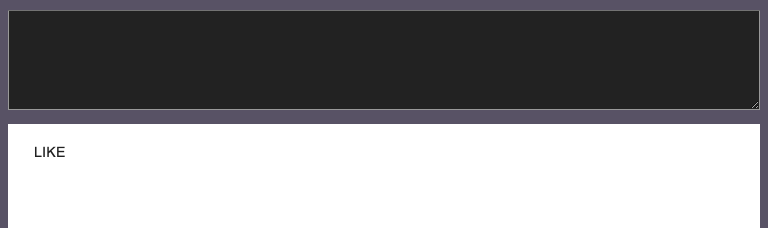
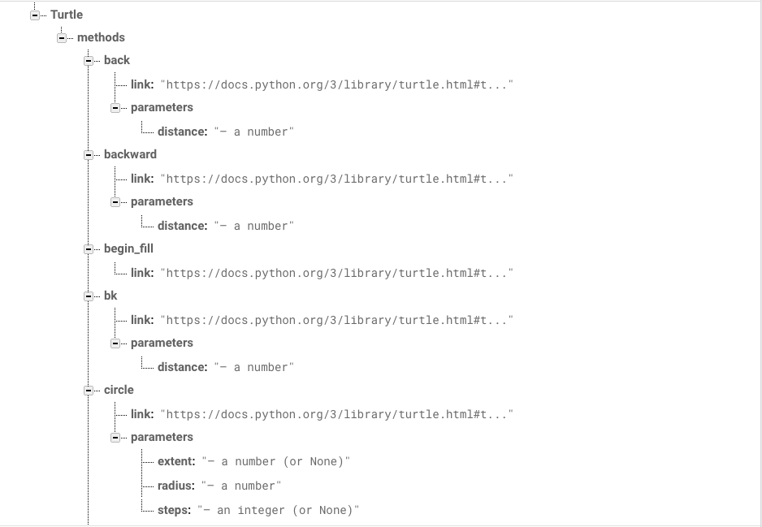
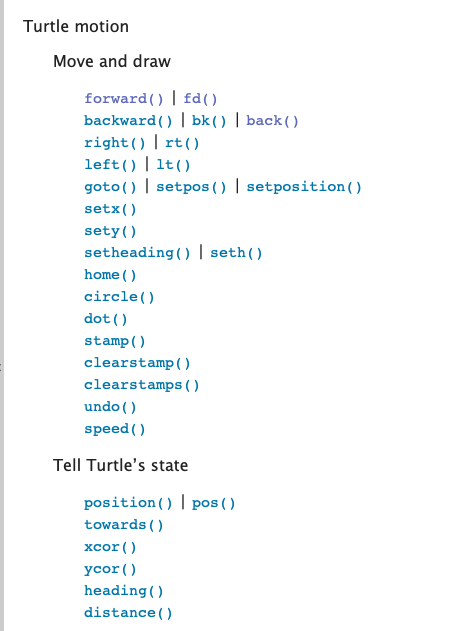
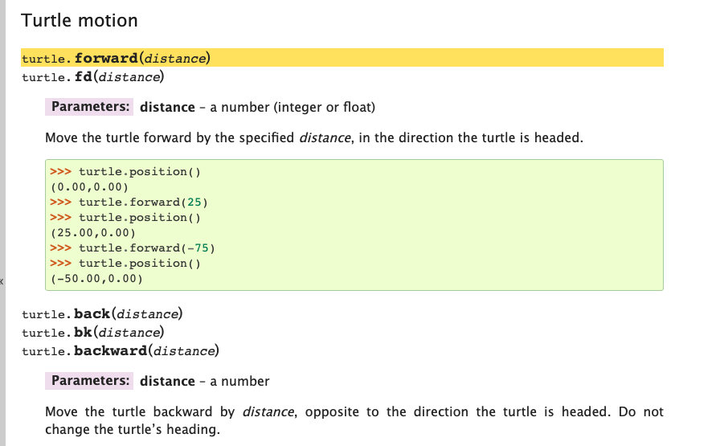
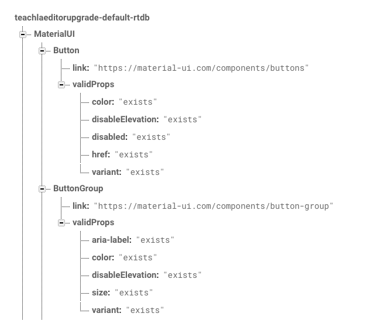
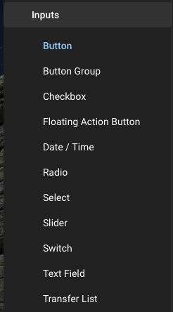
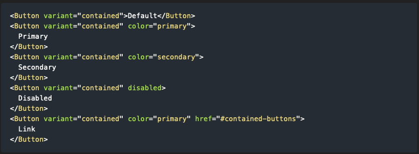

# The Editor In Its Current State
## Python 
The turtle is one of python curriculum team's favorite tools for teaching python. However, if our students misspell a method name or call a function wrong within the turtle library, our Editor's console is ambiguous with the error. And when a student passes the wrong parameters into a method, our console doesn't even tell them about it.

## React
MaterialUI icons is a great way for our students to get started learning react components easily. If a student passes the wrong prop into a component loaded through MaterialUI, tries to load a component that doesn't exist from the library, or uses a prop incorrectly, our editor currently just compiles the code without displaying any warnings. Lost students have no way to find the documentation for each component directly from our editor due to the abstraction of obscuring the import lines at the top of the editor.

In fact, our console doesn't even notify them of any errors!

# My Proposed Solution
By webscraping the documentation of the MaterialUI library and the Turtle library from Python.org, I have taken the first steps to enhancing our editor's console error messages and provide easy access to documentation for our students.
## Python
By parsing the HTML of the documentation via a webscraper, I have extracted each available method in the Turtle library and their parameters, storing it into a Firebase Realtime Database, as well as an easy access link to the method's documentation.
### Database

### Pages Scraped

##React
By parsing the HTML of the documentation via webscraper, I have extracted each available input Component that a student can use from the MaterialUI library, its list of valid props, and an easy access link to that Component's documentation. 
### Database

### Pages Scraped

# Next Steps
With this useful information now at our fingertips, we can have the back-end and front-end teams work together to create a huge amount of Quality Of Life features for our students.

## Python Improvements
When students incorrectly input the method name of a Turtle method or give it the wrong parameters we can simply pull this data from the database and give them suggestions (akin to the spellcheck function of our CS32 Project) and suggest other method names that are valid, instead of simply saying on the console that the attribute doesn't exist. Within the editor itself, we can also create code snippets for each method. With given time, I can use the webscraper to grab code snippets from the documentation for each method that we can pre-load within the editor itself. We would also be able to check method names in real time, warning the user when a method does not exist.

## React Improvements
With the list of available components and props at our fingertips, we can allow the pre-loading of so many more components, not just Buttons. Given time, I can extract code snippets of each component from the documentation as well. Alongside this, we can also prompt the user in the console page to go to a specific component's documentation, and tell them the list of available props and parameters to each component.

# Concluding Thoughts
The editor right now is amazing, but lacks some features that other compilers contain. With a little work, we can introduce a whole slew of quality of life improvements for all users of our editor.
